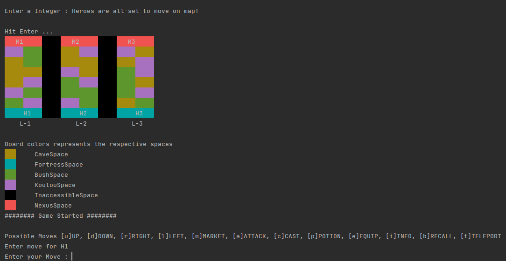

# Legends Of Valor
Legends of Valor isa MOBA (multiplayer online battle arena)-like game. The player will control a team of 3 heroes who will attempt to fight their way through to the monsters’ Nexus.The heroes win if any of them reach the monsters’ Nexus. The heroes lose if any monster reaches the heroes’ Nexus.

# Map View

# Objects Structure

- Terrain       Base class for Nexus and Fortress
  - Nexus       Responsible for generating monsters  (once hero enters here this heroes win)
  - Fortress    Responsible for heroes territory     (once monsters enters heroes loose)
QQ - Do we need both Nexus and Fortress ??
  
- Player        Base class for players, we have 3 heroes for one player

- Items (Product)
  - Spell
    - LightningSpell
    - IceSpell
    - FireSpell
  - Weapon
  - Armor
  - Potion

- Creature
  - Hero
  - Monster

- Lane
  - Impassible
  - Passable

- Space       I think we can drop this space and shift to Lanes (reason being lanes are also build of spaces)
  - Market
  - InAccessible
  - Common

NEW IDEAS

Observer patterns
  - Once any round finishes ... call the observer to regain some health and mana to all the live heroes
  - Once the battle ends ... call the observer to revive all the heroes who had fainted.
  - Once the battle ends ... call the observer to gain experience and gold to all those heroes who were left alive.
  - Update the Creature inventory once any hero CAST the spell or use Potion ... reason being that product is consumable

## IF GETS TIME TO IMPLEMENT  (Think this as backend stuff)
  - Controller who can add new products to the market
  - Controller who can add new Monsters to the Game
  - Controller who can add new Heroes to the Game