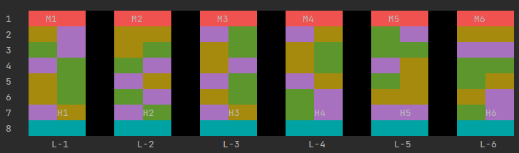

# Legends Of Valor
Legends of Valor isa MOBA (multiplayer online battle arena)-like game. The player will control a team of 3 heroes who will attempt to fight their way through to the monsters’ Nexus.The heroes win if any of them reach the monsters’ Nexus. The heroes lose if any monster reaches the heroes’ Nexus.

# Map View

## DEMO PLAY
<pre>
Hello, Welcome!!!
Which game you want to play today?
[1] Legends Of Valor
Enter your input : 1

		Legends of Valor isa MOBA (multiplayer online battle arena)-like game. 
		The player will control a team of 3 heroes who will attempt to fight their way 
		through to the monsters’ Nexus.The heroes win if any of them reach the monsters’ Nexus. 
		The heroes lose if any monster reaches the heroes’ Nexus.

Default # of Lanes are [3],
Do you want to change it? [YES/yes/y/NO/no/n]
Enter your input : y
Enter a Integer : 20
Please enter a valid # of lanes [3 - 6]
Try again!
Enter a Integer : 6

Enter Player Name
Enter your input : shubham

Enter Number for the type of Hero!
[1] Paladins
[2] Sorcerers
[3] Warriors
Enter a Integer : 1

		######## Hero's ########
Name         Level          Health         Mana           Strength       Agility        Dexterity      Experience     
1 Garl_Glitter 1              100.0/100.0    100.0          600.0          500.0          400.0          5.0/10         
2 Skoraeus_Sto 1              100.0/100.0    250.0          650.0          600.0          350.0          4.0/10         
3 Caliber_Heis 1              100.0/100.0    400.0          400.0          400.0          400.0          8.0/10         
4 Sehanine_Moo 1              100.0/100.0    300.0          750.0          700.0          700.0          7.0/10         
5 Parzival     1              100.0/100.0    300.0          750.0          650.0          700.0          7.0/10         
6 Amaryllis_As 1              100.0/100.0    500.0          500.0          500.0          500.0          5.0/10

Enter a Integer : 1

Enter Number for the type of Hero!
[1] Paladins
[2] Sorcerers
[3] Warriors
Enter a Integer : 1

		######## Hero's ########
Name         Level          Health         Mana           Strength       Agility        Dexterity      Experience     
1 Amaryllis_As 1              100.0/100.0    500.0          500.0          500.0          500.0          5.0/10         
2 Garl_Glitter 1              100.0/100.0    100.0          600.0          500.0          400.0          5.0/10         
3 Sehanine_Moo 1              100.0/100.0    300.0          750.0          700.0          700.0          7.0/10         
4 Caliber_Heis 1              100.0/100.0    400.0          400.0          400.0          400.0          8.0/10         
5 Skoraeus_Sto 1              100.0/100.0    250.0          650.0          600.0          350.0          4.0/10         
6 Parzival     1              100.0/100.0    300.0          750.0          650.0          700.0          7.0/10

Enter a Integer : 1

Enter Number for the type of Hero!
[1] Paladins
[2] Sorcerers
[3] Warriors
Enter a Integer : 1

		######## Hero's ########
Name         Level          Health         Mana           Strength       Agility        Dexterity      Experience     
1 Sehanine_Moo 1              100.0/100.0    300.0          750.0          700.0          700.0          7.0/10         
2 Amaryllis_As 1              100.0/100.0    500.0          500.0          500.0          500.0          5.0/10         
3 Caliber_Heis 1              100.0/100.0    400.0          400.0          400.0          400.0          8.0/10         
4 Skoraeus_Sto 1              100.0/100.0    250.0          650.0          600.0          350.0          4.0/10         
5 Garl_Glitter 1              100.0/100.0    100.0          600.0          500.0          400.0          5.0/10         
6 Parzival     1              100.0/100.0    300.0          750.0          650.0          700.0          7.0/10

Enter a Integer : 1

Enter Number for the type of Hero!
[1] Paladins
[2] Sorcerers
[3] Warriors
Enter a Integer : 1

		######## Hero's ########
Name         Level          Health         Mana           Strength       Agility        Dexterity      Experience     
1 Parzival     1              100.0/100.0    300.0          750.0          650.0          700.0          7.0/10         
2 Amaryllis_As 1              100.0/100.0    500.0          500.0          500.0          500.0          5.0/10         
3 Caliber_Heis 1              100.0/100.0    400.0          400.0          400.0          400.0          8.0/10         
4 Skoraeus_Sto 1              100.0/100.0    250.0          650.0          600.0          350.0          4.0/10         
5 Garl_Glitter 1              100.0/100.0    100.0          600.0          500.0          400.0          5.0/10         
6 Sehanine_Moo 1              100.0/100.0    300.0          750.0          700.0          700.0          7.0/10

Enter a Integer : 1

Enter Number for the type of Hero!
[1] Paladins
[2] Sorcerers
[3] Warriors
Enter a Integer : 1

		######## Hero's ########
Name         Level          Health         Mana           Strength       Agility        Dexterity      Experience     
1 Skoraeus_Sto 1              100.0/100.0    250.0          650.0          600.0          350.0          4.0/10         
2 Amaryllis_As 1              100.0/100.0    500.0          500.0          500.0          500.0          5.0/10         
3 Parzival     1              100.0/100.0    300.0          750.0          650.0          700.0          7.0/10         
4 Garl_Glitter 1              100.0/100.0    100.0          600.0          500.0          400.0          5.0/10         
5 Sehanine_Moo 1              100.0/100.0    300.0          750.0          700.0          700.0          7.0/10         
6 Caliber_Heis 1              100.0/100.0    400.0          400.0          400.0          400.0          8.0/10

Enter a Integer : 1

Enter Number for the type of Hero!
[1] Paladins
[2] Sorcerers
[3] Warriors
Enter a Integer : 1

		######## Hero's ########
Name         Level          Health         Mana           Strength       Agility        Dexterity      Experience     
1 Skoraeus_Sto 1              100.0/100.0    250.0          650.0          600.0          350.0          4.0/10         
2 Sehanine_Moo 1              100.0/100.0    300.0          750.0          700.0          700.0          7.0/10         
3 Caliber_Heis 1              100.0/100.0    400.0          400.0          400.0          400.0          8.0/10         
4 Garl_Glitter 1              100.0/100.0    100.0          600.0          500.0          400.0          5.0/10         
5 Parzival     1              100.0/100.0    300.0          750.0          650.0          700.0          7.0/10         
6 Amaryllis_As 1              100.0/100.0    500.0          500.0          500.0          500.0          5.0/10

Enter a Integer : 1
Heroes are all-set to move on map!

Hit Enter ...
</pre>

<pre>

1	   M1             M2             M3             M4             M5             M6     
2	                                                                                     
3	                                                                                     
4	                                                                                     
5	                                                                                     
6	                                                                                     
7	                                                                                     
8	     H1             H2             H3             H4             H5             H6   
        L-1            L-2            L-3            L-4            L-5            L-6

Each lane (Lane-1, Lane-2, ..) column starts with 1 from left and increase one unit to left
Board colors represents the respective spaces
CaveSpace
FortressSpace
BushSpace
KoulouSpace
InaccessibleSpace
NexusSpace

######## Game Started ########

Possible Moves [u]UP, [d]DOWN, [r]RIGHT, [l]LEFT, [m]MARKET, [q]EXIT,
[a]ATTACK, [c]CAST, [p]POTION, [e]EQUIP, [i]INFO, [b]RECALL, [t]TELEPORT
Enter move for H1
Enter your Move : u

		######## Hero's ########
Name         Level          Health         Mana           Strength       Agility        Dexterity      Experience     
1 Parzival     1              100.0/100.0    300.0          750.0          715.0          700.0          7.0/10

Hit Enter ...
</pre>

<pre>
1	   M1             M2             M3             M4             M5             M6     
2	                                                                                     
3	                                                                                     
4	                                                                                     
5	                                                                                     
6	                                                                                     
7	     H1                                                                              
8	                    H2             H3             H4             H5             H6   
        L-1            L-2            L-3            L-4            L-5            L-6

Each lane (Lane-1, Lane-2, ..) column starts with 1 from left and increase one unit to left
Board colors represents the respective spaces
CaveSpace
FortressSpace
BushSpace
KoulouSpace
InaccessibleSpace
NexusSpace

Possible Moves [u]UP, [d]DOWN, [r]RIGHT, [l]LEFT, [m]MARKET, [q]EXIT,
[a]ATTACK, [c]CAST, [p]POTION, [e]EQUIP, [i]INFO, [b]RECALL, [t]TELEPORT
Enter move for H2
Enter your Move : u

		######## Hero's ########
Name         Level          Health         Mana           Strength       Agility        Dexterity      Experience     
1 Garl_Glitter 1              100.0/100.0    100.0          600.0          500.0          440.0          5.0/10

Hit Enter ...
</pre>

<pre>
1	   M1             M2             M3             M4             M5             M6     
2	                                                                                     
3	                                                                                     
4	                                                                                     
5	                                                                                     
6	                                                                                     
7	     H1             H2                                                               
8	                                   H3             H4             H5             H6   
        L-1            L-2            L-3            L-4            L-5            L-6

Each lane (Lane-1, Lane-2, ..) column starts with 1 from left and increase one unit to left
Board colors represents the respective spaces
CaveSpace
FortressSpace
BushSpace
KoulouSpace
InaccessibleSpace
NexusSpace

Possible Moves [u]UP, [d]DOWN, [r]RIGHT, [l]LEFT, [m]MARKET, [q]EXIT,
[a]ATTACK, [c]CAST, [p]POTION, [e]EQUIP, [i]INFO, [b]RECALL, [t]TELEPORT
Enter move for H3
Enter your Move : u

		######## Hero's ########
Name         Level          Health         Mana           Strength       Agility        Dexterity      Experience     
1 Amaryllis_As 1              100.0/100.0    500.0          500.0          550.0          500.0          5.0/10

Hit Enter ...
</pre>

<pre>
1	   M1             M2             M3             M4             M5             M6     
2	                                                                                     
3	                                                                                     
4	                                                                                     
5	                                                                                     
6	                                                                                     
7	     H1             H2             H3                                                
8	                                                  H4             H5             H6   
        L-1            L-2            L-3            L-4            L-5            L-6

Each lane (Lane-1, Lane-2, ..) column starts with 1 from left and increase one unit to left
Board colors represents the respective spaces
CaveSpace
FortressSpace
BushSpace
KoulouSpace
InaccessibleSpace
NexusSpace

Possible Moves [u]UP, [d]DOWN, [r]RIGHT, [l]LEFT, [m]MARKET, [q]EXIT,
[a]ATTACK, [c]CAST, [p]POTION, [e]EQUIP, [i]INFO, [b]RECALL, [t]TELEPORT
Enter move for H4
Enter your Move : u

		######## Hero's ########
Name         Level          Health         Mana           Strength       Agility        Dexterity      Experience     
1 Sehanine_Moo 1              100.0/100.0    300.0          825.0          700.0          700.0          7.0/10

Hit Enter ...
</pre>

<pre>
1	   M1             M2             M3             M4             M5             M6     
2	                                                                                     
3	                                                                                     
4	                                                                                     
5	                                                                                     
6	                                                                                     
7	     H1             H2             H3             H4                                 
8	                                                                 H5             H6   
        L-1            L-2            L-3            L-4            L-5            L-6

Each lane (Lane-1, Lane-2, ..) column starts with 1 from left and increase one unit to left
Board colors represents the respective spaces
CaveSpace
FortressSpace
BushSpace
KoulouSpace
InaccessibleSpace
NexusSpace

Possible Moves [u]UP, [d]DOWN, [r]RIGHT, [l]LEFT, [m]MARKET, [q]EXIT,
[a]ATTACK, [c]CAST, [p]POTION, [e]EQUIP, [i]INFO, [b]RECALL, [t]TELEPORT
Enter move for H5
Enter your Move : u

		######## Hero's ########
Name         Level          Health         Mana           Strength       Agility        Dexterity      Experience     
1 Amaryllis_As 1              100.0/100.0    500.0          550.0          500.0          500.0          5.0/10

Hit Enter ...
</pre>

<pre>
1	   M1             M2             M3             M4             M5             M6     
2	                                                                                     
3	                                                                                     
4	                                                                                     
5	                                                                                     
6	                                                                                     
7	     H1             H2             H3             H4             H5                  
8	                                                                                H6   
        L-1            L-2            L-3            L-4            L-5            L-6

Each lane (Lane-1, Lane-2, ..) column starts with 1 from left and increase one unit to left
Board colors represents the respective spaces
CaveSpace
FortressSpace
BushSpace
KoulouSpace
InaccessibleSpace
NexusSpace

Possible Moves [u]UP, [d]DOWN, [r]RIGHT, [l]LEFT, [m]MARKET, [q]EXIT,
[a]ATTACK, [c]CAST, [p]POTION, [e]EQUIP, [i]INFO, [b]RECALL, [t]TELEPORT
Enter move for H6
Enter your Move : u

		######## Hero's ########
Name         Level          Health         Mana           Strength       Agility        Dexterity      Experience     
1 Garl_Glitter 1              100.0/100.0    100.0          660.0          500.0          400.0          5.0/10

Hit Enter ...
</pre>

<pre>
1	   M1             M2             M3             M4             M5             M6     
2	                                                                                     
3	                                                                                     
4	                                                                                     
5	                                                                                     
6	                                                                                     
7	     H1             H2             H3             H4             H5             H6   
8	                                                                                     
        L-1            L-2            L-3            L-4            L-5            L-6

Each lane (Lane-1, Lane-2, ..) column starts with 1 from left and increase one unit to left
Board colors represents the respective spaces
CaveSpace
FortressSpace
BushSpace
KoulouSpace
InaccessibleSpace
NexusSpace

Monster M1 playing his move

Hit Enter ...
u

1	                  M2             M3             M4             M5             M6     
2	   M1                                                                                
3	                                                                                     
4	                                                                                     
5	                                                                                     
6	                                                                                     
7	     H1             H2             H3             H4             H5             H6   
8	                                                                                     
        L-1            L-2            L-3            L-4            L-5            L-6

Each lane (Lane-1, Lane-2, ..) column starts with 1 from left and increase one unit to left
Board colors represents the respective spaces
CaveSpace
FortressSpace
BushSpace
KoulouSpace
InaccessibleSpace
NexusSpace

Monster M2 playing his move

Hit Enter ...

1	                                 M3             M4             M5             M6     
2	   M1             M2                                                                 
3	                                                                                     
4	                                                                                     
5	                                                                                     
6	                                                                                     
7	     H1             H2             H3             H4             H5             H6   
8	                                                                                     
        L-1            L-2            L-3            L-4            L-5            L-6

Each lane (Lane-1, Lane-2, ..) column starts with 1 from left and increase one unit to left
Board colors represents the respective spaces
CaveSpace
FortressSpace
BushSpace
KoulouSpace
InaccessibleSpace
NexusSpace

Monster M3 playing his move

Hit Enter ...

1	                                                M4             M5             M6     
2	   M1             M2             M3                                                  
3	                                                                                     
4	                                                                                     
5	                                                                                     
6	                                                                                     
7	     H1             H2             H3             H4             H5             H6   
8	                                                                                     
        L-1            L-2            L-3            L-4            L-5            L-6

Each lane (Lane-1, Lane-2, ..) column starts with 1 from left and increase one unit to left
Board colors represents the respective spaces
CaveSpace
FortressSpace
BushSpace
KoulouSpace
InaccessibleSpace
NexusSpace

Monster M4 playing his move

Hit Enter ...

1	                                                               M5             M6     
2	   M1             M2             M3             M4                                   
3	                                                                                     
4	                                                                                     
5	                                                                                     
6	                                                                                     
7	     H1             H2             H3             H4             H5             H6   
8	                                                                                     
        L-1            L-2            L-3            L-4            L-5            L-6

Each lane (Lane-1, Lane-2, ..) column starts with 1 from left and increase one unit to left
Board colors represents the respective spaces
CaveSpace
FortressSpace
BushSpace
KoulouSpace
InaccessibleSpace
NexusSpace

Monster M5 playing his move

Hit Enter ...

1	                                                                              M6     
2	   M1             M2             M3             M4             M5                    
3	                                                                                     
4	                                                                                     
5	                                                                                     
6	                                                                                     
7	     H1             H2             H3             H4             H5             H6   
8	                                                                                     
        L-1            L-2            L-3            L-4            L-5            L-6

Each lane (Lane-1, Lane-2, ..) column starts with 1 from left and increase one unit to left
Board colors represents the respective spaces
CaveSpace
FortressSpace
BushSpace
KoulouSpace
InaccessibleSpace
NexusSpace

Monster M6 playing his move

Hit Enter ...

1	                                                                                     
2	   M1             M2             M3             M4             M5             M6     
3	                                                                                     
4	                                                                                     
5	                                                                                     
6	                                                                                     
7	     H1             H2             H3             H4             H5             H6   
8	                                                                                     
        L-1            L-2            L-3            L-4            L-5            L-6

Each lane (Lane-1, Lane-2, ..) column starts with 1 from left and increase one unit to left
Board colors represents the respective spaces
CaveSpace
FortressSpace
BushSpace
KoulouSpace
InaccessibleSpace
NexusSpace

Possible Moves [u]UP, [d]DOWN, [r]RIGHT, [l]LEFT, [m]MARKET, [q]EXIT,
[a]ATTACK, [c]CAST, [p]POTION, [e]EQUIP, [i]INFO, [b]RECALL, [t]TELEPORT
Enter move for H1
Enter your Move :
INVALID, Please enter a Character!
Try again!
Enter your Move : a
Invalid Move, Try again!!!
Opponent is far away, Save you moves!

Possible Moves [u]UP, [d]DOWN, [r]RIGHT, [l]LEFT, [m]MARKET, [q]EXIT,
[a]ATTACK, [c]CAST, [p]POTION, [e]EQUIP, [i]INFO, [b]RECALL, [t]TELEPORT
Enter move for H1
Enter your Move : u

		######## Hero's ########
Name         Level          Health         Mana           Strength       Agility        Dexterity      Experience     
1 Parzival     1              100.0/100.0    300.0          750.0          650.0          770.0          7.0/10

Hit Enter ...

1	                                                                                     
2	   M1             M2             M3             M4             M5             M6     
3	                                                                                     
4	                                                                                     
5	                                                                                     
6	     H1                                                                              
7	                    H2             H3             H4             H5             H6   
8	                                                                                     
        L-1            L-2            L-3            L-4            L-5            L-6

Each lane (Lane-1, Lane-2, ..) column starts with 1 from left and increase one unit to left
Board colors represents the respective spaces
CaveSpace
FortressSpace
BushSpace
KoulouSpace
InaccessibleSpace
NexusSpace

Possible Moves [u]UP, [d]DOWN, [r]RIGHT, [l]LEFT, [m]MARKET, [q]EXIT,
[a]ATTACK, [c]CAST, [p]POTION, [e]EQUIP, [i]INFO, [b]RECALL, [t]TELEPORT
Enter move for H2
Enter your Move : u

		######## Hero's ########
Name         Level          Health         Mana           Strength       Agility        Dexterity      Experience     
1 Garl_Glitter 1              100.0/100.0    100.0          660.0          500.0          40.0           5.0/10

Hit Enter ...
</pre>

<pre>
1	                                                                                     
2	   M1             M2             M3             M4             M5             M6     
3	                                                                                     
4	                                                                                     
5	                                                                                     
6	     H1             H2                                                               
7	                                   H3             H4             H5             H6   
8	                                                                                     
        L-1            L-2            L-3            L-4            L-5            L-6

Each lane (Lane-1, Lane-2, ..) column starts with 1 from left and increase one unit to left
Board colors represents the respective spaces
CaveSpace
FortressSpace
BushSpace
KoulouSpace
InaccessibleSpace
NexusSpace

Possible Moves [u]UP, [d]DOWN, [r]RIGHT, [l]LEFT, [m]MARKET, [q]EXIT,
[a]ATTACK, [c]CAST, [p]POTION, [e]EQUIP, [i]INFO, [b]RECALL, [t]TELEPORT
Enter move for H3
Enter your Move : u

		######## Hero's ########
Name         Level          Health         Mana           Strength       Agility        Dexterity      Experience     
1 Amaryllis_As 1              100.0/100.0    500.0          500.0          500.0          550.0          5.0/10

Hit Enter ...

1	                                                                                     
2	   M1             M2             M3             M4             M5             M6     
3	                                                                                     
4	                                                                                     
5	                                                                                     
6	     H1             H2             H3                                                
7	                                                  H4             H5             H6   
8	                                                                                     
        L-1            L-2            L-3            L-4            L-5            L-6

Each lane (Lane-1, Lane-2, ..) column starts with 1 from left and increase one unit to left
Board colors represents the respective spaces
CaveSpace
FortressSpace
BushSpace
KoulouSpace
InaccessibleSpace
NexusSpace

Possible Moves [u]UP, [d]DOWN, [r]RIGHT, [l]LEFT, [m]MARKET, [q]EXIT,
[a]ATTACK, [c]CAST, [p]POTION, [e]EQUIP, [i]INFO, [b]RECALL, [t]TELEPORT
Enter move for H4
Enter your Move : u

		######## Hero's ########
Name         Level          Health         Mana           Strength       Agility        Dexterity      Experience     
1 Sehanine_Moo 1              100.0/100.0    300.0          825.0          700.0          700.0          7.0/10

Hit Enter ...

1	                                                                                     
2	   M1             M2             M3             M4             M5             M6     
3	                                                                                     
4	                                                                                     
5	                                                                                     
6	     H1             H2             H3             H4                                 
7	                                                                 H5             H6   
8	                                                                                     
        L-1            L-2            L-3            L-4            L-5            L-6

Each lane (Lane-1, Lane-2, ..) column starts with 1 from left and increase one unit to left
Board colors represents the respective spaces
CaveSpace
FortressSpace
BushSpace
KoulouSpace
InaccessibleSpace
NexusSpace

Possible Moves [u]UP, [d]DOWN, [r]RIGHT, [l]LEFT, [m]MARKET, [q]EXIT,
[a]ATTACK, [c]CAST, [p]POTION, [e]EQUIP, [i]INFO, [b]RECALL, [t]TELEPORT
Enter move for H5
Enter your Move : u

		######## Hero's ########
Name         Level          Health         Mana           Strength       Agility        Dexterity      Experience     
1 Amaryllis_As 1              100.0/100.0    500.0          500.0          550.0          500.0          5.0/10

Hit Enter ...

1	                                                                                     
2	   M1             M2             M3             M4             M5             M6     
3	                                                                                     
4	                                                                                     
5	                                                                                     
6	     H1             H2             H3             H4             H5                  
7	                                                                                H6   
8	                                                                                     
        L-1            L-2            L-3            L-4            L-5            L-6

Each lane (Lane-1, Lane-2, ..) column starts with 1 from left and increase one unit to left
Board colors represents the respective spaces
CaveSpace
FortressSpace
BushSpace
KoulouSpace
InaccessibleSpace
NexusSpace

Possible Moves [u]UP, [d]DOWN, [r]RIGHT, [l]LEFT, [m]MARKET, [q]EXIT,
[a]ATTACK, [c]CAST, [p]POTION, [e]EQUIP, [i]INFO, [b]RECALL, [t]TELEPORT
Enter move for H6
Enter your Move : u

		######## Hero's ########
Name         Level          Health         Mana           Strength       Agility        Dexterity      Experience     
1 Garl_Glitter 1              100.0/100.0    100.0          660.0          500.0          400.0          5.0/10

Hit Enter ...

1	                                                                                     
2	   M1             M2             M3             M4             M5             M6     
3	                                                                                     
4	                                                                                     
5	                                                                                     
6	     H1             H2             H3             H4             H5             H6   
7	                                                                                     
8	                                                                                     
        L-1            L-2            L-3            L-4            L-5            L-6

Each lane (Lane-1, Lane-2, ..) column starts with 1 from left and increase one unit to left
Board colors represents the respective spaces
CaveSpace
FortressSpace
BushSpace
KoulouSpace
InaccessibleSpace
NexusSpace

Monster M1 playing his move

Hit Enter ...

1	                                                                                     
2	                  M2             M3             M4             M5             M6     
3	   M1                                                                                
4	                                                                                     
5	                                                                                     
6	     H1             H2             H3             H4             H5             H6   
7	                                                                                     
8	                                                                                     
        L-1            L-2            L-3            L-4            L-5            L-6

Each lane (Lane-1, Lane-2, ..) column starts with 1 from left and increase one unit to left
Board colors represents the respective spaces
CaveSpace
FortressSpace
BushSpace
KoulouSpace
InaccessibleSpace
NexusSpace

Monster M2 playing his move

Hit Enter ...

1	                                                                                     
2	                                 M3             M4             M5             M6     
3	   M1             M2                                                                 
4	                                                                                     
5	                                                                                     
6	     H1             H2             H3             H4             H5             H6   
7	                                                                                     
8	                                                                                     
        L-1            L-2            L-3            L-4            L-5            L-6

Each lane (Lane-1, Lane-2, ..) column starts with 1 from left and increase one unit to left
Board colors represents the respective spaces
CaveSpace
FortressSpace
BushSpace
KoulouSpace
InaccessibleSpace
NexusSpace

Monster M3 playing his move

Hit Enter ...

1	                                                                                     
2	                                                M4             M5             M6     
3	   M1             M2             M3                                                  
4	                                                                                     
5	                                                                                     
6	     H1             H2             H3             H4             H5             H6   
7	                                                                                     
8	                                                                                     
        L-1            L-2            L-3            L-4            L-5            L-6

Each lane (Lane-1, Lane-2, ..) column starts with 1 from left and increase one unit to left
Board colors represents the respective spaces
CaveSpace
FortressSpace
BushSpace
KoulouSpace
InaccessibleSpace
NexusSpace

Monster M4 playing his move

Hit Enter ...

1	                                                                                     
2	                                                               M5             M6     
3	   M1             M2             M3             M4                                   
4	                                                                                     
5	                                                                                     
6	     H1             H2             H3             H4             H5             H6   
7	                                                                                     
8	                                                                                     
        L-1            L-2            L-3            L-4            L-5            L-6

Each lane (Lane-1, Lane-2, ..) column starts with 1 from left and increase one unit to left
Board colors represents the respective spaces
CaveSpace
FortressSpace
BushSpace
KoulouSpace
InaccessibleSpace
NexusSpace

Monster M5 playing his move

Hit Enter ...

1	                                                                                     
2	                                                                              M6     
3	   M1             M2             M3             M4             M5                    
4	                                                                                     
5	                                                                                     
6	     H1             H2             H3             H4             H5             H6   
7	                                                                                     
8	                                                                                     
        L-1            L-2            L-3            L-4            L-5            L-6

Each lane (Lane-1, Lane-2, ..) column starts with 1 from left and increase one unit to left
Board colors represents the respective spaces
CaveSpace
FortressSpace
BushSpace
KoulouSpace
InaccessibleSpace
NexusSpace

Monster M6 playing his move

Hit Enter ...

1	                                                                                     
2	                                                                                     
3	   M1             M2             M3             M4             M5             M6     
4	                                                                                     
5	                                                                                     
6	     H1             H2             H3             H4             H5             H6   
7	                                                                                     
8	                                                                                     
        L-1            L-2            L-3            L-4            L-5            L-6

Each lane (Lane-1, Lane-2, ..) column starts with 1 from left and increase one unit to left
Board colors represents the respective spaces
CaveSpace
FortressSpace
BushSpace
KoulouSpace
InaccessibleSpace
NexusSpace

Possible Moves [u]UP, [d]DOWN, [r]RIGHT, [l]LEFT, [m]MARKET, [q]EXIT,
[a]ATTACK, [c]CAST, [p]POTION, [e]EQUIP, [i]INFO, [b]RECALL, [t]TELEPORT
Enter move for H1
Enter your Move :
INVALID, Please enter a Character!
Try again!
Enter your Move :
INVALID, Please enter a Character!
Try again!
Enter your Move : u

		######## Hero's ########
Name         Level          Health         Mana           Strength       Agility        Dexterity      Experience     
1 Parzival     1              100.0/100.0    300.0          750.0          650.0          77.0           7.0/10

Hit Enter ...

1	                                                                                     
2	                                                                                     
3	   M1             M2             M3             M4             M5             M6     
4	                                                                                     
5	     H1                                                                              
6	                    H2             H3             H4             H5             H6   
7	                                                                                     
8	                                                                                     
        L-1            L-2            L-3            L-4            L-5            L-6

Each lane (Lane-1, Lane-2, ..) column starts with 1 from left and increase one unit to left
Board colors represents the respective spaces
CaveSpace
FortressSpace
BushSpace
KoulouSpace
InaccessibleSpace
NexusSpace

Possible Moves [u]UP, [d]DOWN, [r]RIGHT, [l]LEFT, [m]MARKET, [q]EXIT,
[a]ATTACK, [c]CAST, [p]POTION, [e]EQUIP, [i]INFO, [b]RECALL, [t]TELEPORT
Enter move for H2
Enter your Move : u

		######## Hero's ########
Name         Level          Health         Mana           Strength       Agility        Dexterity      Experience     
1 Garl_Glitter 1              100.0/100.0    100.0          600.0          550.0          40.0           5.0/10

Hit Enter ...

1	                                                                                     
2	                                                                                     
3	   M1             M2             M3             M4             M5             M6     
4	                                                                                     
5	     H1             H2                                                               
6	                                   H3             H4             H5             H6   
7	                                                                                     
8	                                                                                     
        L-1            L-2            L-3            L-4            L-5            L-6

Each lane (Lane-1, Lane-2, ..) column starts with 1 from left and increase one unit to left
Board colors represents the respective spaces
CaveSpace
FortressSpace
BushSpace
KoulouSpace
InaccessibleSpace
NexusSpace

Possible Moves [u]UP, [d]DOWN, [r]RIGHT, [l]LEFT, [m]MARKET, [q]EXIT,
[a]ATTACK, [c]CAST, [p]POTION, [e]EQUIP, [i]INFO, [b]RECALL, [t]TELEPORT
Enter move for H3
Enter your Move : u

		######## Hero's ########
Name         Level          Health         Mana           Strength       Agility        Dexterity      Experience     
1 Amaryllis_As 1              100.0/100.0    500.0          500.0          500.0          55.0           5.0/10

Hit Enter ...

1	                                                                                     
2	                                                                                     
3	   M1             M2             M3             M4             M5             M6     
4	                                                                                     
5	     H1             H2             H3                                                
6	                                                  H4             H5             H6   
7	                                                                                     
8	                                                                                     
        L-1            L-2            L-3            L-4            L-5            L-6

Each lane (Lane-1, Lane-2, ..) column starts with 1 from left and increase one unit to left
Board colors represents the respective spaces
CaveSpace
FortressSpace
BushSpace
KoulouSpace
InaccessibleSpace
NexusSpace

Possible Moves [u]UP, [d]DOWN, [r]RIGHT, [l]LEFT, [m]MARKET, [q]EXIT,
[a]ATTACK, [c]CAST, [p]POTION, [e]EQUIP, [i]INFO, [b]RECALL, [t]TELEPORT
Enter move for H4
Enter your Move : u

		######## Hero's ########
Name         Level          Health         Mana           Strength       Agility        Dexterity      Experience     
1 Sehanine_Moo 1              100.0/100.0    300.0          750.0          770.0          700.0          7.0/10

Hit Enter ...

1	                                                                                     
2	                                                                                     
3	   M1             M2             M3             M4             M5             M6     
4	                                                                                     
5	     H1             H2             H3             H4                                 
6	                                                                 H5             H6   
7	                                                                                     
8	                                                                                     
        L-1            L-2            L-3            L-4            L-5            L-6

Each lane (Lane-1, Lane-2, ..) column starts with 1 from left and increase one unit to left
Board colors represents the respective spaces
CaveSpace
FortressSpace
BushSpace
KoulouSpace
InaccessibleSpace
NexusSpace

Possible Moves [u]UP, [d]DOWN, [r]RIGHT, [l]LEFT, [m]MARKET, [q]EXIT,
[a]ATTACK, [c]CAST, [p]POTION, [e]EQUIP, [i]INFO, [b]RECALL, [t]TELEPORT
Enter move for H5
Enter your Move : u

		######## Hero's ########
Name         Level          Health         Mana           Strength       Agility        Dexterity      Experience     
1 Amaryllis_As 1              100.0/100.0    500.0          500.0          550.0          500.0          5.0/10

Hit Enter ...

1	                                                                                     
2	                                                                                     
3	   M1             M2             M3             M4             M5             M6     
4	                                                                                     
5	     H1             H2             H3             H4             H5                  
6	                                                                                H6   
7	                                                                                     
8	                                                                                     
        L-1            L-2            L-3            L-4            L-5            L-6

Each lane (Lane-1, Lane-2, ..) column starts with 1 from left and increase one unit to left
Board colors represents the respective spaces
CaveSpace
FortressSpace
BushSpace
KoulouSpace
InaccessibleSpace
NexusSpace

Possible Moves [u]UP, [d]DOWN, [r]RIGHT, [l]LEFT, [m]MARKET, [q]EXIT,
[a]ATTACK, [c]CAST, [p]POTION, [e]EQUIP, [i]INFO, [b]RECALL, [t]TELEPORT
Enter move for H6
Enter your Move : u

		######## Hero's ########
Name         Level          Health         Mana           Strength       Agility        Dexterity      Experience     
1 Garl_Glitter 1              100.0/100.0    100.0          600.0          550.0          400.0          5.0/10

Hit Enter ...

1	                                                                                     
2	                                                                                     
3	   M1             M2             M3             M4             M5             M6     
4	                                                                                     
5	     H1             H2             H3             H4             H5             H6   
6	                                                                                     
7	                                                                                     
8	                                                                                     
        L-1            L-2            L-3            L-4            L-5            L-6

Each lane (Lane-1, Lane-2, ..) column starts with 1 from left and increase one unit to left
Board colors represents the respective spaces
CaveSpace
FortressSpace
BushSpace
KoulouSpace
InaccessibleSpace
NexusSpace

Monster M1 playing his move

Hit Enter ...
u

1	                                                                                     
2	                                                                                     
3	                  M2             M3             M4             M5             M6     
4	   M1                                                                                
5	     H1             H2             H3             H4             H5             H6   
6	                                                                                     
7	                                                                                     
8	                                                                                     
        L-1            L-2            L-3            L-4            L-5            L-6

Each lane (Lane-1, Lane-2, ..) column starts with 1 from left and increase one unit to left
Board colors represents the respective spaces
CaveSpace
FortressSpace
BushSpace
KoulouSpace
InaccessibleSpace
NexusSpace

Monster M2 playing his move

Hit Enter ...

1	                                                                                     
2	                                                                                     
3	                                 M3             M4             M5             M6     
4	   M1             M2                                                                 
5	     H1             H2             H3             H4             H5             H6   
6	                                                                                     
7	                                                                                     
8	                                                                                     
        L-1            L-2            L-3            L-4            L-5            L-6

Each lane (Lane-1, Lane-2, ..) column starts with 1 from left and increase one unit to left
Board colors represents the respective spaces
CaveSpace
FortressSpace
BushSpace
KoulouSpace
InaccessibleSpace
NexusSpace

Monster M3 playing his move

Hit Enter ...

1	                                                                                     
2	                                                                                     
3	                                                M4             M5             M6     
4	   M1             M2             M3                                                  
5	     H1             H2             H3             H4             H5             H6   
6	                                                                                     
7	                                                                                     
8	                                                                                     
        L-1            L-2            L-3            L-4            L-5            L-6

Each lane (Lane-1, Lane-2, ..) column starts with 1 from left and increase one unit to left
Board colors represents the respective spaces
CaveSpace
FortressSpace
BushSpace
KoulouSpace
InaccessibleSpace
NexusSpace

Monster M4 playing his move

Hit Enter ...

1	                                                                                     
2	                                                                                     
3	                                                               M5             M6     
4	   M1             M2             M3             M4                                   
5	     H1             H2             H3             H4             H5             H6   
6	                                                                                     
7	                                                                                     
8	                                                                                     
        L-1            L-2            L-3            L-4            L-5            L-6

Each lane (Lane-1, Lane-2, ..) column starts with 1 from left and increase one unit to left
Board colors represents the respective spaces
CaveSpace
FortressSpace
BushSpace
KoulouSpace
InaccessibleSpace
NexusSpace

Monster M5 playing his move

Hit Enter ...

1	                                                                                     
2	                                                                                     
3	                                                                              M6     
4	   M1             M2             M3             M4             M5                    
5	     H1             H2             H3             H4             H5             H6   
6	                                                                                     
7	                                                                                     
8	                                                                                     
        L-1            L-2            L-3            L-4            L-5            L-6

Each lane (Lane-1, Lane-2, ..) column starts with 1 from left and increase one unit to left
Board colors represents the respective spaces
CaveSpace
FortressSpace
BushSpace
KoulouSpace
InaccessibleSpace
NexusSpace

Monster M6 playing his move

Hit Enter ...

1	                                                                                     
2	                                                                                     
3	                                                                                     
4	   M1             M2             M3             M4             M5             M6     
5	     H1             H2             H3             H4             H5             H6   
6	                                                                                     
7	                                                                                     
8	                                                                                     
        L-1            L-2            L-3            L-4            L-5            L-6

Each lane (Lane-1, Lane-2, ..) column starts with 1 from left and increase one unit to left
Board colors represents the respective spaces
CaveSpace
FortressSpace
BushSpace
KoulouSpace
InaccessibleSpace
NexusSpace

Possible Moves [u]UP, [d]DOWN, [r]RIGHT, [l]LEFT, [m]MARKET, [q]EXIT,
[a]ATTACK, [c]CAST, [p]POTION, [e]EQUIP, [i]INFO, [b]RECALL, [t]TELEPORT
Enter move for H1
Enter your Move : a
Parzival attacked Natsunomeryu with damage of 137.5

Natsunomeryu fainted by the attack of Parzival

		######## Hero's ########
Name         Level          Health         Mana           Strength       Agility        Dexterity      Experience     
1 Parzival     1              100.0/100.0    300.0          750.0          650.0          77.0           9.0/10

Hit Enter ...
</pre>

<pre>
1	                                                                                     
2	                                                                                     
3	                                                                                     
4	                  M2             M3             M4             M5             M6     
5	     H1             H2             H3             H4             H5             H6   
6	                                                                                     
7	                                                                                     
8	                                                                                     
        L-1            L-2            L-3            L-4            L-5            L-6

Each lane (Lane-1, Lane-2, ..) column starts with 1 from left and increase one unit to left
Board colors represents the respective spaces
CaveSpace
FortressSpace
BushSpace
KoulouSpace
InaccessibleSpace
NexusSpace

Possible Moves [u]UP, [d]DOWN, [r]RIGHT, [l]LEFT, [m]MARKET, [q]EXIT,
[a]ATTACK, [c]CAST, [p]POTION, [e]EQUIP, [i]INFO, [b]RECALL, [t]TELEPORT
Enter move for H2
Enter your Move : a
Garl_Glittergold attacked Casper with damage of 170.0

Casper fainted by the attack of Garl_Glittergold

		######## Hero's ########
Name         Level          Health         Mana           Strength       Agility        Dexterity      Experience     
1 Garl_Glitter 1              100.0/100.0    100.0          600.0          550.0          40.0           7.0/10

Hit Enter ...

1	                                                                                     
2	                                                                                     
3	                                                                                     
4	                                 M3             M4             M5             M6     
5	     H1             H2             H3             H4             H5             H6   
6	                                                                                     
7	                                                                                     
8	                                                                                     
        L-1            L-2            L-3            L-4            L-5            L-6

Each lane (Lane-1, Lane-2, ..) column starts with 1 from left and increase one unit to left
Board colors represents the respective spaces
CaveSpace
FortressSpace
BushSpace
KoulouSpace
InaccessibleSpace
NexusSpace

Possible Moves [u]UP, [d]DOWN, [r]RIGHT, [l]LEFT, [m]MARKET, [q]EXIT,
[a]ATTACK, [c]CAST, [p]POTION, [e]EQUIP, [i]INFO, [b]RECALL, [t]TELEPORT
Enter move for H3
Enter your Move : a
Amaryllis_Astra attacked Natsunomeryu with damage of 25.0

		######## Hero's ########
Name         Level          Health         Mana           Strength       Agility        Dexterity      Experience     
1 Amaryllis_As 1              100.0/100.0    500.0          500.0          500.0          55.0           5.0/10

Hit Enter ...
a

1	                                                                                     
2	                                                                                     
3	                                                                                     
4	                                 M3             M4             M5             M6     
5	     H1             H2             H3             H4             H5             H6   
6	                                                                                     
7	                                                                                     
8	                                                                                     
        L-1            L-2            L-3            L-4            L-5            L-6

Each lane (Lane-1, Lane-2, ..) column starts with 1 from left and increase one unit to left
Board colors represents the respective spaces
CaveSpace
FortressSpace
BushSpace
KoulouSpace
InaccessibleSpace
NexusSpace

Possible Moves [u]UP, [d]DOWN, [r]RIGHT, [l]LEFT, [m]MARKET, [q]EXIT,
[a]ATTACK, [c]CAST, [p]POTION, [e]EQUIP, [i]INFO, [b]RECALL, [t]TELEPORT
Enter move for H4
Enter your Move : a
Sehanine_Moonbow attacked BigBad-Wolf with damage of 87.5

		######## Hero's ########
Name         Level          Health         Mana           Strength       Agility        Dexterity      Experience     
1 Sehanine_Moo 1              100.0/100.0    300.0          750.0          770.0          700.0          7.0/10

Hit Enter ...

1	                                                                                     
2	                                                                                     
3	                                                                                     
4	                                 M3             M4             M5             M6     
5	     H1             H2             H3             H4             H5             H6   
6	                                                                                     
7	                                                                                     
8	                                                                                     
        L-1            L-2            L-3            L-4            L-5            L-6

Each lane (Lane-1, Lane-2, ..) column starts with 1 from left and increase one unit to left
Board colors represents the respective spaces
CaveSpace
FortressSpace
BushSpace
KoulouSpace
InaccessibleSpace
NexusSpace

Possible Moves [u]UP, [d]DOWN, [r]RIGHT, [l]LEFT, [m]MARKET, [q]EXIT,
[a]ATTACK, [c]CAST, [p]POTION, [e]EQUIP, [i]INFO, [b]RECALL, [t]TELEPORT
Enter move for H5
Enter your Move : a
Amaryllis_Astra attacked BigBad-Wolf
Nice Job!, BigBad-Wolf defended Amaryllis_Astra fully!

		######## Hero's ########
Name         Level          Health         Mana           Strength       Agility        Dexterity      Experience     
1 Amaryllis_As 1              100.0/100.0    500.0          500.0          550.0          500.0          5.0/10

Hit Enter ...

1	                                                                                     
2	                                                                                     
3	                                                                                     
4	                                 M3             M4             M5             M6     
5	     H1             H2             H3             H4             H5             H6   
6	                                                                                     
7	                                                                                     
8	                                                                                     
        L-1            L-2            L-3            L-4            L-5            L-6

Each lane (Lane-1, Lane-2, ..) column starts with 1 from left and increase one unit to left
Board colors represents the respective spaces
CaveSpace
FortressSpace
BushSpace
KoulouSpace
InaccessibleSpace
NexusSpace

Possible Moves [u]UP, [d]DOWN, [r]RIGHT, [l]LEFT, [m]MARKET, [q]EXIT,
[a]ATTACK, [c]CAST, [p]POTION, [e]EQUIP, [i]INFO, [b]RECALL, [t]TELEPORT
Enter move for H6
Enter your Move : u

		######## Hero's ########
Name         Level          Health         Mana           Strength       Agility        Dexterity      Experience     
1 Garl_Glitter 1              100.0/100.0    100.0          600.0          500.0          440.0          5.0/10

Hit Enter ...

1	                                                                                     
2	                                                                                     
3	                                                                                     
4	                                 M3             M4             M5             M6H6   
5	     H1             H2             H3             H4             H5                  
6	                                                                                     
7	                                                                                     
8	                                                                                     
        L-1            L-2            L-3            L-4            L-5            L-6

Each lane (Lane-1, Lane-2, ..) column starts with 1 from left and increase one unit to left
Board colors represents the respective spaces
CaveSpace
FortressSpace
BushSpace
KoulouSpace
InaccessibleSpace
NexusSpace

Monster M3 playing his move

Hit Enter ...
</pre>

<pre>
1	                                                                                     
2	                                                                                     
3	                                                                                     
4	                                                M4             M5             M6H6   
5	     H1             H2           M3H3             H4             H5                  
6	                                                                                     
7	                                                                                     
8	                                                                                     
        L-1            L-2            L-3            L-4            L-5            L-6

Each lane (Lane-1, Lane-2, ..) column starts with 1 from left and increase one unit to left
Board colors represents the respective spaces
CaveSpace
FortressSpace
BushSpace
KoulouSpace
InaccessibleSpace
NexusSpace

Monster M4 playing his move

Hit Enter ...

1	                                                                                     
2	                                                                                     
3	                                                                                     
4	                                                               M5             M6H6   
5	     H1             H2           M3H3           M4H4             H5                  
6	                                                                                     
7	                                                                                     
8	                                                                                     
        L-1            L-2            L-3            L-4            L-5            L-6

Each lane (Lane-1, Lane-2, ..) column starts with 1 from left and increase one unit to left
Board colors represents the respective spaces
CaveSpace
FortressSpace
BushSpace
KoulouSpace
InaccessibleSpace
NexusSpace

Monster M5 playing his move

Hit Enter ...

1	                                                                                     
2	                                                                                     
3	                                                                                     
4	                                                                              M6H6   
5	     H1             H2           M3H3           M4H4           M5H5                  
6	                                                                                     
7	                                                                                     
8	                                                                                     
        L-1            L-2            L-3            L-4            L-5            L-6

Each lane (Lane-1, Lane-2, ..) column starts with 1 from left and increase one unit to left
Board colors represents the respective spaces
CaveSpace
FortressSpace
BushSpace
KoulouSpace
InaccessibleSpace
NexusSpace

Monster M6 playing his move
Casper attacked Garl_Glittergold with damage of 40.0

Hit Enter ...

1	                                                                                     
2	                                                                                     
3	                                                                                     
4	                                                                              M6H6   
5	     H1             H2           M3H3           M4H4           M5H5                  
6	                                                                                     
7	                                                                                     
8	                                                                                     
        L-1            L-2            L-3            L-4            L-5            L-6

Each lane (Lane-1, Lane-2, ..) column starts with 1 from left and increase one unit to left
Board colors represents the respective spaces
CaveSpace
FortressSpace
BushSpace
KoulouSpace
InaccessibleSpace
NexusSpace

Possible Moves [u]UP, [d]DOWN, [r]RIGHT, [l]LEFT, [m]MARKET, [q]EXIT,
[a]ATTACK, [c]CAST, [p]POTION, [e]EQUIP, [i]INFO, [b]RECALL, [t]TELEPORT
Enter move for H1
Enter your Move : u

		######## Hero's ########
Name         Level          Health         Mana           Strength       Agility        Dexterity      Experience     
1 Parzival     1              100.0/100.0    300.0          750.0          650.0          7.7            9.0/10

Hit Enter ...

1	                                                                                     
2	                                                                                     
3	                                                                                     
4	     H1                                                                       M6H6   
5	                    H2           M3H3           M4H4           M5H5                  
6	                                                                                     
7	                                                                                     
8	                                                                                     
        L-1            L-2            L-3            L-4            L-5            L-6

Each lane (Lane-1, Lane-2, ..) column starts with 1 from left and increase one unit to left
Board colors represents the respective spaces
CaveSpace
FortressSpace
BushSpace
KoulouSpace
InaccessibleSpace
NexusSpace

Possible Moves [u]UP, [d]DOWN, [r]RIGHT, [l]LEFT, [m]MARKET, [q]EXIT,
[a]ATTACK, [c]CAST, [p]POTION, [e]EQUIP, [i]INFO, [b]RECALL, [t]TELEPORT
Enter move for H2
Enter your Move : u

		######## Hero's ########
Name         Level          Health         Mana           Strength       Agility        Dexterity      Experience     
1 Garl_Glitter 1              100.0/100.0    100.0          660.0          500.0          40.0           7.0/10

Hit Enter ...

1	                                                                                     
2	                                                                                     
3	                                                                                     
4	     H1             H2                                                        M6H6   
5	                                 M3H3           M4H4           M5H5                  
6	                                                                                     
7	                                                                                     
8	                                                                                     
        L-1            L-2            L-3            L-4            L-5            L-6

Each lane (Lane-1, Lane-2, ..) column starts with 1 from left and increase one unit to left
Board colors represents the respective spaces
CaveSpace
FortressSpace
BushSpace
KoulouSpace
InaccessibleSpace
NexusSpace

Possible Moves [u]UP, [d]DOWN, [r]RIGHT, [l]LEFT, [m]MARKET, [q]EXIT,
[a]ATTACK, [c]CAST, [p]POTION, [e]EQUIP, [i]INFO, [b]RECALL, [t]TELEPORT
Enter move for H3
Enter your Move : a
Amaryllis_Astra attacked Natsunomeryu with damage of 25.0

		######## Hero's ########
Name         Level          Health         Mana           Strength       Agility        Dexterity      Experience     
1 Amaryllis_As 1              100.0/100.0    500.0          500.0          500.0          55.0           5.0/10

Hit Enter ...

1	                                                                                     
2	                                                                                     
3	                                                                                     
4	     H1             H2                                                        M6H6   
5	                                 M3H3           M4H4           M5H5                  
6	                                                                                     
7	                                                                                     
8	                                                                                     
        L-1            L-2            L-3            L-4            L-5            L-6

Each lane (Lane-1, Lane-2, ..) column starts with 1 from left and increase one unit to left
Board colors represents the respective spaces
CaveSpace
FortressSpace
BushSpace
KoulouSpace
InaccessibleSpace
NexusSpace

Possible Moves [u]UP, [d]DOWN, [r]RIGHT, [l]LEFT, [m]MARKET, [q]EXIT,
[a]ATTACK, [c]CAST, [p]POTION, [e]EQUIP, [i]INFO, [b]RECALL, [t]TELEPORT
Enter move for H4
Enter your Move : a
Sehanine_Moonbow attacked BigBad-Wolf with damage of 87.5

BigBad-Wolf fainted by the attack of Sehanine_Moonbow

		######## Hero's ########
Name         Level          Health         Mana           Strength       Agility        Dexterity      Experience     
1 Sehanine_Moo 1              100.0/100.0    300.0          750.0          770.0          700.0          9.0/10

Hit Enter ...

1	                                                                                     
2	                                                                                     
3	                                                                                     
4	     H1             H2                                                        M6H6   
5	                                 M3H3             H4           M5H5                  
6	                                                                                     
7	                                                                                     
8	                                                                                     
        L-1            L-2            L-3            L-4            L-5            L-6

Each lane (Lane-1, Lane-2, ..) column starts with 1 from left and increase one unit to left
Board colors represents the respective spaces
CaveSpace
FortressSpace
BushSpace
KoulouSpace
InaccessibleSpace
NexusSpace

Possible Moves [u]UP, [d]DOWN, [r]RIGHT, [l]LEFT, [m]MARKET, [q]EXIT,
[a]ATTACK, [c]CAST, [p]POTION, [e]EQUIP, [i]INFO, [b]RECALL, [t]TELEPORT
Enter move for H5
Enter your Move : u
Invalid Move, Try again!!!
Cannot move UP/DOWN when another creature near by!

Possible Moves [u]UP, [d]DOWN, [r]RIGHT, [l]LEFT, [m]MARKET, [q]EXIT,
[a]ATTACK, [c]CAST, [p]POTION, [e]EQUIP, [i]INFO, [b]RECALL, [t]TELEPORT
Enter move for H5
Enter your Move : d

		######## Hero's ########
Name         Level          Health         Mana           Strength       Agility        Dexterity      Experience     
1 Amaryllis_As 1              100.0/100.0    500.0          500.0          550.0          500.0          5.0/10

Hit Enter ...

1	                                                                                     
2	                                                                                     
3	                                                                                     
4	     H1             H2                                                        M6H6   
5	                                 M3H3             H4           M5                    
6	                                                                 H5                  
7	                                                                                     
8	                                                                                     
        L-1            L-2            L-3            L-4            L-5            L-6

Each lane (Lane-1, Lane-2, ..) column starts with 1 from left and increase one unit to left
Board colors represents the respective spaces
CaveSpace
FortressSpace
BushSpace
KoulouSpace
InaccessibleSpace
NexusSpace

Possible Moves [u]UP, [d]DOWN, [r]RIGHT, [l]LEFT, [m]MARKET, [q]EXIT,
[a]ATTACK, [c]CAST, [p]POTION, [e]EQUIP, [i]INFO, [b]RECALL, [t]TELEPORT
Enter move for H6
Enter your Move : a
Garl_Glittergold attacked Casper with damage of 170.0

Casper fainted by the attack of Garl_Glittergold

		######## Hero's ########
Name         Level          Health         Mana           Strength       Agility        Dexterity      Experience     
1 Garl_Glitter 1              66.0/100.0     110.0000000000 600.0          500.0          440.0          7.0/10

Hit Enter ...

1	                                                                                     
2	                                                                                     
3	                                                                                     
4	     H1             H2                                                          H6   
5	                                 M3H3             H4           M5                    
6	                                                                 H5                  
7	                                                                                     
8	                                                                                     
        L-1            L-2            L-3            L-4            L-5            L-6

Each lane (Lane-1, Lane-2, ..) column starts with 1 from left and increase one unit to left
Board colors represents the respective spaces
CaveSpace
FortressSpace
BushSpace
KoulouSpace
InaccessibleSpace
NexusSpace

Monster M3 playing his move
Natsunomeryu attacked Amaryllis_Astra with damage of 60.0

Hit Enter ...

1	                                                                                     
2	                                                                                     
3	                                                                                     
4	     H1             H2                                                          H6   
5	                                 M3H3             H4           M5                    
6	                                                                 H5                  
7	                                                                                     
8	                                                                                     
        L-1            L-2            L-3            L-4            L-5            L-6

Each lane (Lane-1, Lane-2, ..) column starts with 1 from left and increase one unit to left
Board colors represents the respective spaces
CaveSpace
FortressSpace
BushSpace
KoulouSpace
InaccessibleSpace
NexusSpace

Monster M5 playing his move

Hit Enter ...

1	                                                                                     
2	                                                                                     
3	                                                                                     
4	     H1             H2                                                          H6   
5	                                 M3H3             H4                                 
6	                                                               M5H5                  
7	                                                                                     
8	                                                                                     
        L-1            L-2            L-3            L-4            L-5            L-6

Each lane (Lane-1, Lane-2, ..) column starts with 1 from left and increase one unit to left
Board colors represents the respective spaces
CaveSpace
FortressSpace
BushSpace
KoulouSpace
InaccessibleSpace
NexusSpace

Possible Moves [u]UP, [d]DOWN, [r]RIGHT, [l]LEFT, [m]MARKET, [q]EXIT,
[a]ATTACK, [c]CAST, [p]POTION, [e]EQUIP, [i]INFO, [b]RECALL, [t]TELEPORT
Enter move for H1
Enter your Move : INVALID, Please enter a Character!
Try again!
Enter your Move : a
Invalid Move, Try again!!!
Opponent is far away, Save you moves!

Possible Moves [u]UP, [d]DOWN, [r]RIGHT, [l]LEFT, [m]MARKET, [q]EXIT,
[a]ATTACK, [c]CAST, [p]POTION, [e]EQUIP, [i]INFO, [b]RECALL, [t]TELEPORT
Enter move for H1
Enter your Move : u

		######## Hero's ########
Name         Level          Health         Mana           Strength       Agility        Dexterity      Experience     
1 Parzival     1              100.0/100.0    300.0          825.0          650.0          0.700000000000 9.0/10

Hit Enter ...

1	                                                                                     
2	                                                                                     
3	     H1                                                                              
4	                    H2                                                          H6   
5	                                 M3H3             H4                                 
6	                                                               M5H5                  
7	                                                                                     
8	                                                                                     
        L-1            L-2            L-3            L-4            L-5            L-6

Each lane (Lane-1, Lane-2, ..) column starts with 1 from left and increase one unit to left
Board colors represents the respective spaces
CaveSpace
FortressSpace
BushSpace
KoulouSpace
InaccessibleSpace
NexusSpace

Possible Moves [u]UP, [d]DOWN, [r]RIGHT, [l]LEFT, [m]MARKET, [q]EXIT,
[a]ATTACK, [c]CAST, [p]POTION, [e]EQUIP, [i]INFO, [b]RECALL, [t]TELEPORT
Enter move for H2
Enter your Move : u

		######## Hero's ########
Name         Level          Health         Mana           Strength       Agility        Dexterity      Experience     
1 Garl_Glitter 1              100.0/100.0    100.0          600.0          500.0          44.0           7.0/10

Hit Enter ...

1	                                                                                     
2	                                                                                     
3	     H1             H2                                                               
4	                                                                                H6   
5	                                 M3H3             H4                                 
6	                                                               M5H5                  
7	                                                                                     
8	                                                                                     
        L-1            L-2            L-3            L-4            L-5            L-6

Each lane (Lane-1, Lane-2, ..) column starts with 1 from left and increase one unit to left
Board colors represents the respective spaces
CaveSpace
FortressSpace
BushSpace
KoulouSpace
InaccessibleSpace
NexusSpace

Possible Moves [u]UP, [d]DOWN, [r]RIGHT, [l]LEFT, [m]MARKET, [q]EXIT,
[a]ATTACK, [c]CAST, [p]POTION, [e]EQUIP, [i]INFO, [b]RECALL, [t]TELEPORT
Enter move for H3
Enter your Move : a
Amaryllis_Astra attacked Natsunomeryu with damage of 25.0

		######## Hero's ########
Name         Level          Health         Mana           Strength       Agility        Dexterity      Experience     
1 Amaryllis_As 1              44.0/100.0     550.0          500.0          500.0          55.0           5.0/10

Hit Enter ...

1	                                                                                     
2	                                                                                     
3	     H1             H2                                                               
4	                                                                                H6   
5	                                 M3H3             H4                                 
6	                                                               M5H5                  
7	                                                                                     
8	                                                                                     
        L-1            L-2            L-3            L-4            L-5            L-6

Each lane (Lane-1, Lane-2, ..) column starts with 1 from left and increase one unit to left
Board colors represents the respective spaces
CaveSpace
FortressSpace
BushSpace
KoulouSpace
InaccessibleSpace
NexusSpace

Possible Moves [u]UP, [d]DOWN, [r]RIGHT, [l]LEFT, [m]MARKET, [q]EXIT,
[a]ATTACK, [c]CAST, [p]POTION, [e]EQUIP, [i]INFO, [b]RECALL, [t]TELEPORT
Enter move for H4
Enter your Move : u

		######## Hero's ########
Name         Level          Health         Mana           Strength       Agility        Dexterity      Experience     
1 Sehanine_Moo 1              100.0/100.0    300.0          750.0          700.0          770.0          9.0/10

Hit Enter ...

1	                                                                                     
2	                                                                                     
3	     H1             H2                                                               
4	                                                  H4                            H6   
5	                                 M3H3                                                
6	                                                               M5H5                  
7	                                                                                     
8	                                                                                     
        L-1            L-2            L-3            L-4            L-5            L-6

Each lane (Lane-1, Lane-2, ..) column starts with 1 from left and increase one unit to left
Board colors represents the respective spaces
CaveSpace
FortressSpace
BushSpace
KoulouSpace
InaccessibleSpace
NexusSpace

Possible Moves [u]UP, [d]DOWN, [r]RIGHT, [l]LEFT, [m]MARKET, [q]EXIT,
[a]ATTACK, [c]CAST, [p]POTION, [e]EQUIP, [i]INFO, [b]RECALL, [t]TELEPORT
Enter move for H5
Enter your Move : a
Amaryllis_Astra attacked BigBad-Wolf
Nice Job!, BigBad-Wolf defended Amaryllis_Astra fully!

		######## Hero's ########
Name         Level          Health         Mana           Strength       Agility        Dexterity      Experience     
1 Amaryllis_As 1              100.0/100.0    500.0          500.0          550.0          500.0          5.0/10

Hit Enter ...

1	                                                                                     
2	                                                                                     
3	     H1             H2                                                               
4	                                                  H4                            H6   
5	                                 M3H3                                                
6	                                                               M5H5                  
7	                                                                                     
8	                                                                                     
        L-1            L-2            L-3            L-4            L-5            L-6

Each lane (Lane-1, Lane-2, ..) column starts with 1 from left and increase one unit to left
Board colors represents the respective spaces
CaveSpace
FortressSpace
BushSpace
KoulouSpace
InaccessibleSpace
NexusSpace

Possible Moves [u]UP, [d]DOWN, [r]RIGHT, [l]LEFT, [m]MARKET, [q]EXIT,
[a]ATTACK, [c]CAST, [p]POTION, [e]EQUIP, [i]INFO, [b]RECALL, [t]TELEPORT
Enter move for H6
Enter your Move : u

		######## Hero's ########
Name         Level          Health         Mana           Strength       Agility        Dexterity      Experience     
1 Garl_Glitter 1              66.0/100.0     110.0000000000 660.0          500.0          40.0           7.0/10

Hit Enter ...

1	                                                                                     
2	                                                                                     
3	     H1             H2                                                          H6   
4	                                                  H4                                 
5	                                 M3H3                                                
6	                                                               M5H5                  
7	                                                                                     
8	                                                                                     
        L-1            L-2            L-3            L-4            L-5            L-6

Each lane (Lane-1, Lane-2, ..) column starts with 1 from left and increase one unit to left
Board colors represents the respective spaces
CaveSpace
FortressSpace
BushSpace
KoulouSpace
InaccessibleSpace
NexusSpace

Monster M3 playing his move
Natsunomeryu attacked Amaryllis_Astra with damage of 60.0

Hit Enter ...
</pre>

<pre>
1	   M7             M8             M9             M10             M11             M12     
2	                                                                                     
3	     H1             H2                                                          H6   
4	                                                  H4                                 
5	                                 M3H3                                                
6	                                                               M5H5                  
7	                                                                                     
8	                                                                                     
        L-1            L-2            L-3            L-4            L-5            L-6

Each lane (Lane-1, Lane-2, ..) column starts with 1 from left and increase one unit to left
Board colors represents the respective spaces
CaveSpace
FortressSpace
BushSpace
KoulouSpace
InaccessibleSpace
NexusSpace

Monster M5 playing his move
BigBad-Wolf attacked Amaryllis_Astra with damage of 100.0

Hit Enter ...

1	   M7             M8             M9             M10             M11             M12     
2	                                                                                     
3	     H1             H2                                                          H6   
4	                                                  H4                                 
5	                                 M3H3                                                
6	                                                               M5H5                  
7	                                                                                     
8	                                                                                     
        L-1            L-2            L-3            L-4            L-5            L-6

Each lane (Lane-1, Lane-2, ..) column starts with 1 from left and increase one unit to left
Board colors represents the respective spaces
CaveSpace
FortressSpace
BushSpace
KoulouSpace
InaccessibleSpace
NexusSpace

Possible Moves [u]UP, [d]DOWN, [r]RIGHT, [l]LEFT, [m]MARKET, [q]EXIT,
[a]ATTACK, [c]CAST, [p]POTION, [e]EQUIP, [i]INFO, [b]RECALL, [t]TELEPORT
Enter move for H1
Enter your Move : u

		######## Hero's ########
Name         Level          Health         Mana           Strength       Agility        Dexterity      Experience     
1 Parzival     1              100.0/100.0    300.0          825.0          650.0          0.700000000000 9.0/10

Hit Enter ...

1	   M7             M8             M9             M10             M11             M12     
2	     H1                                                                              
3	                    H2                                                          H6   
4	                                                  H4                                 
5	                                 M3H3                                                
6	                                                               M5H5                  
7	                                                                                     
8	                                                                                     
        L-1            L-2            L-3            L-4            L-5            L-6

Each lane (Lane-1, Lane-2, ..) column starts with 1 from left and increase one unit to left
Board colors represents the respective spaces
CaveSpace
FortressSpace
BushSpace
KoulouSpace
InaccessibleSpace
NexusSpace

Possible Moves [u]UP, [d]DOWN, [r]RIGHT, [l]LEFT, [m]MARKET, [q]EXIT,
[a]ATTACK, [c]CAST, [p]POTION, [e]EQUIP, [i]INFO, [b]RECALL, [t]TELEPORT
Enter move for H2
Enter your Move : INVALID, Please enter a Character!
Try again!
Enter your Move : u

		######## Hero's ########
Name         Level          Health         Mana           Strength       Agility        Dexterity      Experience     
1 Garl_Glitter 1              100.0/100.0    100.0          600.0          550.0          4.0            7.0/10

Hit Enter ...

1	   M7             M8             M9             M10             M11             M12     
2	     H1             H2                                                               
3	                                                                                H6   
4	                                                  H4                                 
5	                                 M3H3                                                
6	                                                               M5H5                  
7	                                                                                     
8	                                                                                     
        L-1            L-2            L-3            L-4            L-5            L-6

Each lane (Lane-1, Lane-2, ..) column starts with 1 from left and increase one unit to left
Board colors represents the respective spaces
CaveSpace
FortressSpace
BushSpace
KoulouSpace
InaccessibleSpace
NexusSpace

Possible Moves [u]UP, [d]DOWN, [r]RIGHT, [l]LEFT, [m]MARKET, [q]EXIT,
[a]ATTACK, [c]CAST, [p]POTION, [e]EQUIP, [i]INFO, [b]RECALL, [t]TELEPORT
Enter move for H3
Enter your Move : a
Amaryllis_Astra attacked Natsunomeryu with damage of 25.0

Natsunomeryu fainted by the attack of Amaryllis_Astra

		######## Hero's ########
Name         Level          Health         Mana           Strength       Agility        Dexterity      Experience     
1 Amaryllis_As 1              0.0/100.0      605.0          500.0          500.0          55.0           7.0/10

Hit Enter ...

1	   M7             M8             M9             M10             M11             M12     
2	     H1             H2                                                               
3	                                                                                H6   
4	                                                  H4                                 
5	                                   H3                                                
6	                                                               M5H5                  
7	                                                                                     
8	                                                                                     
        L-1            L-2            L-3            L-4            L-5            L-6

Each lane (Lane-1, Lane-2, ..) column starts with 1 from left and increase one unit to left
Board colors represents the respective spaces
CaveSpace
FortressSpace
BushSpace
KoulouSpace
InaccessibleSpace
NexusSpace

Possible Moves [u]UP, [d]DOWN, [r]RIGHT, [l]LEFT, [m]MARKET, [q]EXIT,
[a]ATTACK, [c]CAST, [p]POTION, [e]EQUIP, [i]INFO, [b]RECALL, [t]TELEPORT
Enter move for H4
Enter your Move : u

		######## Hero's ########
Name         Level          Health         Mana           Strength       Agility        Dexterity      Experience     
1 Sehanine_Moo 1              100.0/100.0    300.0          750.0          700.0          77.0           9.0/10

Hit Enter ...

1	   M7             M8             M9             M10             M11             M12     
2	     H1             H2                                                               
3	                                                  H4                            H6   
4	                                                                                     
5	                                   H3                                                
6	                                                               M5H5                  
7	                                                                                     
8	                                                                                     
        L-1            L-2            L-3            L-4            L-5            L-6

Each lane (Lane-1, Lane-2, ..) column starts with 1 from left and increase one unit to left
Board colors represents the respective spaces
CaveSpace
FortressSpace
BushSpace
KoulouSpace
InaccessibleSpace
NexusSpace

Possible Moves [u]UP, [d]DOWN, [r]RIGHT, [l]LEFT, [m]MARKET, [q]EXIT,
[a]ATTACK, [c]CAST, [p]POTION, [e]EQUIP, [i]INFO, [b]RECALL, [t]TELEPORT
Enter move for H5
Enter your Move : a
Amaryllis_Astra attacked BigBad-Wolf
Nice Job!, BigBad-Wolf defended Amaryllis_Astra fully!

		######## Hero's ########
Name         Level          Health         Mana           Strength       Agility        Dexterity      Experience     
1 Amaryllis_As 1              0.0/100.0      550.0          500.0          550.0          500.0          5.0/10

Hit Enter ...

1	   M7             M8             M9             M10             M11             M12     
2	     H1             H2                                                               
3	                                                  H4                            H6   
4	                                                                                     
5	                                   H3                                                
6	                                                               M5H5                  
7	                                                                                     
8	                                                                                     
        L-1            L-2            L-3            L-4            L-5            L-6

Each lane (Lane-1, Lane-2, ..) column starts with 1 from left and increase one unit to left
Board colors represents the respective spaces
CaveSpace
FortressSpace
BushSpace
KoulouSpace
InaccessibleSpace
NexusSpace

Possible Moves [u]UP, [d]DOWN, [r]RIGHT, [l]LEFT, [m]MARKET, [q]EXIT,
[a]ATTACK, [c]CAST, [p]POTION, [e]EQUIP, [i]INFO, [b]RECALL, [t]TELEPORT
Enter move for H6
Enter your Move : u

		######## Hero's ########
Name         Level          Health         Mana           Strength       Agility        Dexterity      Experience     
1 Garl_Glitter 1              66.0/100.0     110.0000000000 600.0          550.0          40.0           7.0/10

Hit Enter ...

1	   M7             M8             M9             M10             M11             M12     
2	     H1             H2                                                          H6   
3	                                                  H4                                 
4	                                                                                     
5	                                   H3                                                
6	                                                               M5H5                  
7	                                                                                     
8	                                                                                     
        L-1            L-2            L-3            L-4            L-5            L-6

Each lane (Lane-1, Lane-2, ..) column starts with 1 from left and increase one unit to left
Board colors represents the respective spaces
CaveSpace
FortressSpace
BushSpace
KoulouSpace
InaccessibleSpace
NexusSpace

Monster M5 playing his move
BigBad-Wolf attacked Amaryllis_Astra with damage of 100.0

Hit Enter ...

1	   M7             M8             M9             M10             M11             M12     
2	     H1             H2                                                          H6   
3	                                                  H4                                 
4	                                                                                     
5	                                   H3                                                
6	                                                               M5H5                  
7	                                                                                     
8	                                                                                     
        L-1            L-2            L-3            L-4            L-5            L-6

Each lane (Lane-1, Lane-2, ..) column starts with 1 from left and increase one unit to left
Board colors represents the respective spaces
CaveSpace
FortressSpace
BushSpace
KoulouSpace
InaccessibleSpace
NexusSpace

Monster M7 playing his move

Hit Enter ...

1	                  M8             M9             M10             M11             M12     
2	   M7H1             H2                                                          H6   
3	                                                  H4                                 
4	                                                                                     
5	                                   H3                                                
6	                                                               M5H5                  
7	                                                                                     
8	                                                                                     
        L-1            L-2            L-3            L-4            L-5            L-6

Each lane (Lane-1, Lane-2, ..) column starts with 1 from left and increase one unit to left
Board colors represents the respective spaces
CaveSpace
FortressSpace
BushSpace
KoulouSpace
InaccessibleSpace
NexusSpace

Monster M8 playing his move

Hit Enter ...

1	                                 M9             M10             M11             M12     
2	   M7H1           M8H2                                                          H6   
3	                                                  H4                                 
4	                                                                                     
5	                                   H3                                                
6	                                                               M5H5                  
7	                                                                                     
8	                                                                                     
        L-1            L-2            L-3            L-4            L-5            L-6

Each lane (Lane-1, Lane-2, ..) column starts with 1 from left and increase one unit to left
Board colors represents the respective spaces
CaveSpace
FortressSpace
BushSpace
KoulouSpace
InaccessibleSpace
NexusSpace

Monster M9 playing his move

Hit Enter ...

1	                                                M10             M11             M12     
2	   M7H1           M8H2           M9                                             H6   
3	                                                  H4                                 
4	                                                                                     
5	                                   H3                                                
6	                                                               M5H5                  
7	                                                                                     
8	                                                                                     
        L-1            L-2            L-3            L-4            L-5            L-6

Each lane (Lane-1, Lane-2, ..) column starts with 1 from left and increase one unit to left
Board colors represents the respective spaces
CaveSpace
FortressSpace
BushSpace
KoulouSpace
InaccessibleSpace
NexusSpace

Monster M10 playing his move

Hit Enter ...

1	                                                               M11             M12     
2	   M7H1           M8H2           M9             M10                              H6   
3	                                                  H4                                 
4	                                                                                     
5	                                   H3                                                
6	                                                               M5H5                  
7	                                                                                     
8	                                                                                     
        L-1            L-2            L-3            L-4            L-5            L-6

Each lane (Lane-1, Lane-2, ..) column starts with 1 from left and increase one unit to left
Board colors represents the respective spaces
CaveSpace
FortressSpace
BushSpace
KoulouSpace
InaccessibleSpace
NexusSpace

Monster M11 playing his move

Hit Enter ...

1	                                                                              M12     
2	   M7H1           M8H2           M9             M10             M11               H6   
3	                                                  H4                                 
4	                                                                                     
5	                                   H3                                                
6	                                                               M5H5                  
7	                                                                                     
8	                                                                                     
        L-1            L-2            L-3            L-4            L-5            L-6

Each lane (Lane-1, Lane-2, ..) column starts with 1 from left and increase one unit to left
Board colors represents the respective spaces
CaveSpace
FortressSpace
BushSpace
KoulouSpace
InaccessibleSpace
NexusSpace

Monster M12 playing his move

Hit Enter ...

1	                                                                                     
2	   M7H1           M8H2           M9             M10             M11             M12H6   
3	                                                  H4                                 
4	                                                                                     
5	                                   H3                                                
6	                                                               M5H5                  
7	                                                                                     
8	                                                                                     
        L-1            L-2            L-3            L-4            L-5            L-6

Each lane (Lane-1, Lane-2, ..) column starts with 1 from left and increase one unit to left
Board colors represents the respective spaces
CaveSpace
FortressSpace
BushSpace
KoulouSpace
InaccessibleSpace
NexusSpace

Possible Moves [u]UP, [d]DOWN, [r]RIGHT, [l]LEFT, [m]MARKET, [q]EXIT,
[a]ATTACK, [c]CAST, [p]POTION, [e]EQUIP, [i]INFO, [b]RECALL, [t]TELEPORT
Enter move for H1
Enter your Move : a
Parzival attacked Casper with damage of 271.25

Casper fainted by the attack of Parzival

		######## Hero's ########
Name         Level          Health         Mana           Strength       Agility        Dexterity      Experience     
1 Parzival     2              300.0/300.0    330.0          1691.25        1332.5         0.700000000000 11.0/20

Hit Enter ...
</pre>

<pre>
1	                                                                                     
2	     H1           M8H2           M9             M10             M11             M12H6   
3	                                                  H4                                 
4	                                                                                     
5	                                   H3                                                
6	                                                               M5H5                  
7	                                                                                     
8	                                                                                     
        L-1            L-2            L-3            L-4            L-5            L-6

Each lane (Lane-1, Lane-2, ..) column starts with 1 from left and increase one unit to left
Board colors represents the respective spaces
CaveSpace
FortressSpace
BushSpace
KoulouSpace
InaccessibleSpace
NexusSpace

Possible Moves [u]UP, [d]DOWN, [r]RIGHT, [l]LEFT, [m]MARKET, [q]EXIT,
[a]ATTACK, [c]CAST, [p]POTION, [e]EQUIP, [i]INFO, [b]RECALL, [t]TELEPORT
Enter move for H2
Enter your Move : a
Garl_Glittergold attacked Blinky
Nice Job!, Blinky defended Garl_Glittergold fully!

		######## Hero's ########
Name         Level          Health         Mana           Strength       Agility        Dexterity      Experience     
1 Garl_Glitter 1              100.0/100.0    100.0          600.0          550.0          4.0            7.0/10

Hit Enter ...

1	                                                                                     
2	     H1           M8H2           M9             M10             M11             M12H6   
3	                                                  H4                                 
4	                                                                                     
5	                                   H3                                                
6	                                                               M5H5                  
7	                                                                                     
8	                                                                                     
        L-1            L-2            L-3            L-4            L-5            L-6

Each lane (Lane-1, Lane-2, ..) column starts with 1 from left and increase one unit to left
Board colors represents the respective spaces
CaveSpace
FortressSpace
BushSpace
KoulouSpace
InaccessibleSpace
NexusSpace

Possible Moves [u]UP, [d]DOWN, [r]RIGHT, [l]LEFT, [m]MARKET, [q]EXIT,
[a]ATTACK, [c]CAST, [p]POTION, [e]EQUIP, [i]INFO, [b]RECALL, [t]TELEPORT
Enter move for H3
Enter your Move : a
Invalid Move, Try again!!!
Opponent is far away, Save you moves!

Possible Moves [u]UP, [d]DOWN, [r]RIGHT, [l]LEFT, [m]MARKET, [q]EXIT,
[a]ATTACK, [c]CAST, [p]POTION, [e]EQUIP, [i]INFO, [b]RECALL, [t]TELEPORT
Enter move for H3
Enter your Move : u

		######## Hero's ########
Name         Level          Health         Mana           Strength       Agility        Dexterity      Experience     
1 Amaryllis_As 1              0.0/100.0      605.0          550.0          500.0          5.0            7.0/10

Hit Enter ...

1	                                                                                     
2	     H1           M8H2           M9             M10             M11             M12H6   
3	                                                  H4                                 
4	                                   H3                                                
5	                                                                                     
6	                                                               M5H5                  
7	                                                                                     
8	                                                                                     
        L-1            L-2            L-3            L-4            L-5            L-6

Each lane (Lane-1, Lane-2, ..) column starts with 1 from left and increase one unit to left
Board colors represents the respective spaces
CaveSpace
FortressSpace
BushSpace
KoulouSpace
InaccessibleSpace
NexusSpace

Possible Moves [u]UP, [d]DOWN, [r]RIGHT, [l]LEFT, [m]MARKET, [q]EXIT,
[a]ATTACK, [c]CAST, [p]POTION, [e]EQUIP, [i]INFO, [b]RECALL, [t]TELEPORT
Enter move for H4
Enter your Move : a
Sehanine_Moonbow attacked Blinky
Nice Job!, Blinky defended Sehanine_Moonbow fully!

		######## Hero's ########
Name         Level          Health         Mana           Strength       Agility        Dexterity      Experience     
1 Sehanine_Moo 1              100.0/100.0    300.0          750.0          700.0          77.0           9.0/10

Hit Enter ...

1	                                                                                     
2	     H1           M8H2           M9             M10             M11             M12H6   
3	                                                  H4                                 
4	                                   H3                                                
5	                                                                                     
6	                                                               M5H5                  
7	                                                                                     
8	                                                                                     
        L-1            L-2            L-3            L-4            L-5            L-6

Each lane (Lane-1, Lane-2, ..) column starts with 1 from left and increase one unit to left
Board colors represents the respective spaces
CaveSpace
FortressSpace
BushSpace
KoulouSpace
InaccessibleSpace
NexusSpace

Possible Moves [u]UP, [d]DOWN, [r]RIGHT, [l]LEFT, [m]MARKET, [q]EXIT,
[a]ATTACK, [c]CAST, [p]POTION, [e]EQUIP, [i]INFO, [b]RECALL, [t]TELEPORT
Enter move for H5
Enter your Move : a
Amaryllis_Astra attacked BigBad-Wolf
Nice Job!, BigBad-Wolf defended Amaryllis_Astra fully!

		######## Hero's ########
Name         Level          Health         Mana           Strength       Agility        Dexterity      Experience     
1 Amaryllis_As 1              0.0/100.0      605.0          500.0          550.0          500.0          5.0/10

Hit Enter ...

1	                                                                                     
2	     H1           M8H2           M9             M10             M11             M12H6   
3	                                                  H4                                 
4	                                   H3                                                
5	                                                                                     
6	                                                               M5H5                  
7	                                                                                     
8	                                                                                     
        L-1            L-2            L-3            L-4            L-5            L-6

Each lane (Lane-1, Lane-2, ..) column starts with 1 from left and increase one unit to left
Board colors represents the respective spaces
CaveSpace
FortressSpace
BushSpace
KoulouSpace
InaccessibleSpace
NexusSpace

Possible Moves [u]UP, [d]DOWN, [r]RIGHT, [l]LEFT, [m]MARKET, [q]EXIT,
[a]ATTACK, [c]CAST, [p]POTION, [e]EQUIP, [i]INFO, [b]RECALL, [t]TELEPORT
Enter move for H6
Enter your Move : a
Garl_Glittergold attacked Natsunomeryu with damage of 70.0

		######## Hero's ########
Name         Level          Health         Mana           Strength       Agility        Dexterity      Experience     
1 Garl_Glitter 1              66.0/100.0     110.0000000000 600.0          550.0          40.0           7.0/10

Hit Enter ...

1	                                                                                     
2	     H1           M8H2           M9             M10             M11             M12H6   
3	                                                  H4                                 
4	                                   H3                                                
5	                                                                                     
6	                                                               M5H5                  
7	                                                                                     
8	                                                                                     
        L-1            L-2            L-3            L-4            L-5            L-6

Each lane (Lane-1, Lane-2, ..) column starts with 1 from left and increase one unit to left
Board colors represents the respective spaces
CaveSpace
FortressSpace
BushSpace
KoulouSpace
InaccessibleSpace
NexusSpace

Monster M5 playing his move
BigBad-Wolf attacked Amaryllis_Astra with damage of 100.0

Hit Enter ...

1	                                                                                     
2	     H1           M8H2           M9             M10             M11             M12H6   
3	                                                  H4                                 
4	                                   H3                                                
5	                                                                                     
6	                                                               M5H5                  
7	                                                                                     
8	                                                                                     
        L-1            L-2            L-3            L-4            L-5            L-6

Each lane (Lane-1, Lane-2, ..) column starts with 1 from left and increase one unit to left
Board colors represents the respective spaces
CaveSpace
FortressSpace
BushSpace
KoulouSpace
InaccessibleSpace
NexusSpace

Monster M8 playing his move

Blinky dodged the attack by Garl_Glittergold
Blinky attacked Garl_Glittergold with damage of 390.0

Hit Enter ...

1	                                                                                     
2	     H1           M8H2           M9             M10             M11             M12H6   
3	                                                  H4                                 
4	                                   H3                                                
5	                                                                                     
6	                                                               M5H5                  
7	                                                                                     
8	                                                                                     
        L-1            L-2            L-3            L-4            L-5            L-6

Each lane (Lane-1, Lane-2, ..) column starts with 1 from left and increase one unit to left
Board colors represents the respective spaces
CaveSpace
FortressSpace
BushSpace
KoulouSpace
InaccessibleSpace
NexusSpace

Monster M9 playing his move

Hit Enter ...

1	                                                                                     
2	     H1           M8H2                          M10             M11             M12H6   
3	                                 M9               H4                                 
4	                                   H3                                                
5	                                                                                     
6	                                                               M5H5                  
7	                                                                                     
8	                                                                                     
        L-1            L-2            L-3            L-4            L-5            L-6

Each lane (Lane-1, Lane-2, ..) column starts with 1 from left and increase one unit to left
Board colors represents the respective spaces
CaveSpace
FortressSpace
BushSpace
KoulouSpace
InaccessibleSpace
NexusSpace

Monster M10 playing his move

Hit Enter ...

1	                                                                                     
2	     H1           M8H2                                         M11             M12H6   
3	                                 M9             M10H4                                 
4	                                   H3                                                
5	                                                                                     
6	                                                               M5H5                  
7	                                                                                     
8	                                                                                     
        L-1            L-2            L-3            L-4            L-5            L-6

Each lane (Lane-1, Lane-2, ..) column starts with 1 from left and increase one unit to left
Board colors represents the respective spaces
CaveSpace
FortressSpace
BushSpace
KoulouSpace
InaccessibleSpace
NexusSpace

Monster M11 playing his move

Hit Enter ...

1	                                                                                     
2	     H1           M8H2                                                        M12H6   
3	                                 M9             M10H4           M11                    
4	                                   H3                                                
5	                                                                                     
6	                                                               M5H5                  
7	                                                                                     
8	                                                                                     
        L-1            L-2            L-3            L-4            L-5            L-6

Each lane (Lane-1, Lane-2, ..) column starts with 1 from left and increase one unit to left
Board colors represents the respective spaces
CaveSpace
FortressSpace
BushSpace
KoulouSpace
InaccessibleSpace
NexusSpace

Monster M12 playing his move
Natsunomeryu attacked Garl_Glittergold with damage of 40.0

Hit Enter ...

1	                                                                                     
2	     H1           M8H2                                                        M12H6   
3	                                 M9             M10H4           M11                    
4	                                   H3                                                
5	                                                                                     
6	                                                               M5H5                  
7	                                                                                     
8	                                                                                     
        L-1            L-2            L-3            L-4            L-5            L-6

Each lane (Lane-1, Lane-2, ..) column starts with 1 from left and increase one unit to left
Board colors represents the respective spaces
CaveSpace
FortressSpace
BushSpace
KoulouSpace
InaccessibleSpace
NexusSpace

Possible Moves [u]UP, [d]DOWN, [r]RIGHT, [l]LEFT, [m]MARKET, [q]EXIT,
[a]ATTACK, [c]CAST, [p]POTION, [e]EQUIP, [i]INFO, [b]RECALL, [t]TELEPORT
Enter move for H1
Enter your Move :
INVALID, Please enter a Character!
Try again!
Enter your Move : u

		######## Hero's ########
Name         Level          Health         Mana           Strength       Agility        Dexterity      Experience     
1 Parzival     2              300.0/300.0    330.0          750.0          1332.5         0.700000000000 11.0/20

Hit Enter ...
</pre>

<pre>
1	     H1                                                                              
2	                  M8H2                                                        M12H6   
3	                                 M9             M10H4           M11                    
4	                                   H3                                                
5	                                                                                     
6	                                                               M5H5                  
7	                                                                                     
8	                                                                                     
        L-1            L-2            L-3            L-4            L-5            L-6

Each lane (Lane-1, Lane-2, ..) column starts with 1 from left and increase one unit to left
Board colors represents the respective spaces
CaveSpace
FortressSpace
BushSpace
KoulouSpace
InaccessibleSpace
NexusSpace

######## Congratulations!!!, shubham Won this Game ########

# Objects Structure

- Terrain       Base class for Nexus and Fortress
  - Nexus       Responsible for generating monsters  (once hero enters here this heroes win)
  - Fortress    Responsible for heroes territory     (once monsters enters heroes loose)
QQ - Do we need both Nexus and Fortress ??
  
- Player        Base class for players, we have 3 heroes for one player

- Items (Product)
  - Spell
    - LightningSpell
    - IceSpell
    - FireSpell
  - Weapon
  - Armor
  - Potion

- Creature
  - Hero
  - Monster

- Lane
  - Impassible
  - Passable

- Space       I think we can drop this space and shift to Lanes (reason being lanes are also build of spaces)
  - Market
  - InAccessible
  - Common

NEW IDEAS

Observer patterns
  - Once any round finishes ... call the observer to regain some health and mana to all the live heroes
  - Once the battle ends ... call the observer to revive all the heroes who had fainted.
  - Once the battle ends ... call the observer to gain experience and gold to all those heroes who were left alive.
  - Update the Creature inventory once any hero CAST the spell or use Potion ... reason being that product is consumable

## IF GETS TIME TO IMPLEMENT  (Think this as backend stuff)
  - Controller who can add new products to the market
  - Controller who can add new Monsters to the Game
  - Controller who can add new Heroes to the Game